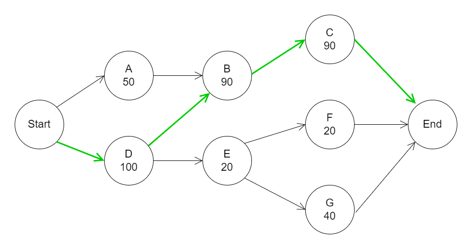

[](https://github.com/NovoNordisk-OpenSource/critical-path/actions/workflows/github-code-scanning/codeql)
[](https://opensource.org/licenses/MIT)


# Critical Path Method
This is an implementation of the [Critical Path Method](https://hbr.org/1963/09/the-abcs-of-the-critical-path-method). The activities are treated as a graph, and is stored as a adjencency list graph. When determining the order of activities (and checking for cyclic dependencies), the activities are being topological sorted (using [Kahn's algorithm](https://en.wikipedia.org/wiki/Topological_sorting#Kahn's_algorithm)).

# Usage
## Examples
See the `NovoNordisk.CriticalPath.Console` and the `NovoNordisk.CriticalPath.Tests` projects for working examples.

In general, create a `HashSet` of activities and use it as an argument to the `Execute(...)` function in the `CriticalPathMethod`.

Here is a simple example:



```C#
// Create activities
var activityEnd = new Activity(name: "Finish", cost: 0);
var activityC = new Activity(name: "C", cost: 90, dependencies: activityEnd);
var activityG = new Activity(name: "G", cost: 40, dependencies: activityEnd);
var activityF = new Activity(name: "F", cost: 20, dependencies: activityEnd);
var activityB = new Activity(name: "B", cost: 90, dependencies: activityC);
var activityE = new Activity(name: "E", cost: 20, dependencies: [activityG, activityF]);
var activityA = new Activity(name: "A", cost: 50, dependencies: activityB);
var activityD = new Activity(name: "D", cost: 100, dependencies: [activityB, activityE]);
var activityStart = new Activity(name: "Start", cost: 0, dependencies: [activityA, activityD]);

// Add activities to HashSet
var activities = new HashSet<Activity>
{
    activityEnd, activityC, activityG, activityF, activityB,
    activityE, activityA, activityD, activityStart,
};

// Calculate critical path
var criticalPathMethod = new CriticalPathMethod();
var criticalPath = criticalPathMethod.Execute(activities);

// Print critical path and its total cost
Console.WriteLine("Critical Path: " + criticalPath.Select(_ => _.Name).Aggregate((a, b) => $"{a} -> {b}"));
Console.WriteLine("Critical Path Cost: " + criticalPath.Sum(_ => _.Cost));

// Output:
// Critical Path: Start -> D -> B -> C -> Finish                                       
// Critical Path Cost: 280    
```

# Notes
## Equal Critical Paths
If the graph contains two equal critical paths, and therefore both have a total float of 0, then the 
algorithm will return the first path in the given graph. It will not return both.

## Two Paths That Does Not Intersect
If the graph contains two paths that does not intersect, then they'll both have a total float of 0.
In that case the algorithm will return the first path in the given graph. It will not return both.

One could argue that it should return the one with the highest total cost, but this is not implemented. 
If this is the desired functionality then we should modify `CriticalActivities()` where the initial 
activity is found: `initialActivities.First(_ => _.TotalFloat == 0);`. 

## Free Float for the Final Task
We define this as 0. You could argue that it is infinite.

## Map your own domain objects to activities
You can use the activity id property to keep a reference between your own domain objects and critical path activities.

```csharp
var drinkCoffeeActivity = new Activity("Drink Coffee", myDrinkCoffeeObject.durationMs, cleanMugActivity);
{
    Id = myDrinkCoffeeObject.Id,
};
```

Another option could be to let your domain objects inherit the `Activity` class. 

# How to Contribute
## Branching Strategy
Trunk based branching strategy is used. New features are added by creating feature branches that are then merged to main with a pull request. 
Pull requests requires the build pipeline to pass. 

## Versioning
The nuget package follows [semver.org](https://www.semver.org).

## Release Procedure
These are the steps needed to create a new release:
1. Make sure the `CHANGELOG.md`is up to date in tha main branch.
2. In GitHub, create a new release. 
   1. The tag version should be the same as the version in the `CHANGELOG.md` file, prefixed with a 'v'. For example `v1.2.3`.
   2. The release title should be the version number. Fx `1.2.3`. The release title is used as the version number in the nuget package.
3. The release pipeline will now create a new nuget package and publish it to nuget.org.

To build and publish the nuget package manually, do the following:
1. Build and test the solution `dotnet build` and `dotnet test`
2. Package the nuget package with the right version: `dotnet pack NovoNordisk.CriticalPath -c Release /p:PackageVersion=[SEMVER. Fx 1.2.3]`

# References
Based on:
* https://www.workamajig.com/blog/critical-path-method
* https://stackoverflow.com/a/9774655/2787333
* https://stackoverflow.com/questions/2985317/critical-path-method-algorithm
* https://www.codeproject.com/Articles/25312/Critical-Path-Method-Implementation-in-C
* https://github.com/elerch/Critical-Path-Extension-Method-for-.NET
